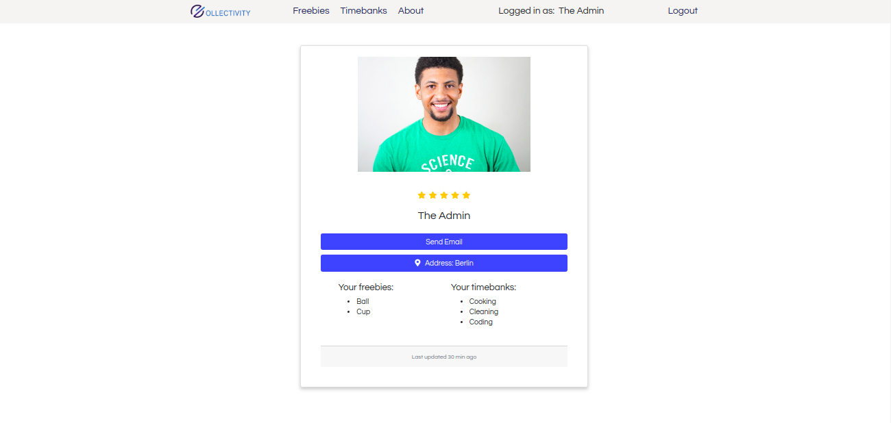

# Collectivity is a platform for sharing objects or skills. You can ask for/offer objects in the freebies page or offer/ask for skills in the time banks section.

You can participate in the project with your code, donating or simply by telling your friends about it. There are still some parts that need to be finished before we can deploy it! You can check what needs to be done in the projects board.



IF YOU WANT TO CODE:
To initialize:

1. install dependencies and create a .env
2. run frontend

- open frontend folder on terminal and run npm start

3. run docker postgres container (see provide database container)
4. run backend

- open backend folder on terminal and run npm run watch (in the beginning again and again so everything is created)

## provide database container:

Start backend: Open terminal:
`sudo docker run --rm --name pg-docker -e POSTGRES_PASSWORD=docker -d -p 4000:5432 -v $HOME/docker/volumes/postgres:/var/lib/postgresql/data postgres`

Check if pg-docker is already running:  
`sudo docker ps -a`

```
CONTAINER ID        IMAGE               COMMAND                  CREATED             STATUS              PORTS                    NAMES
d1a04c805227        postgres            "docker-entrypoint.s…"   6 minutes ago       Up 6 minutes        0.0.0.0:4000->5432/tcp   pg-docker

```

Stop container:

`sudo docker stop <NAME/ID>`

e.g. `sudo docker stop pg-docker`

Update Docker:
`sudo apt-get update && sudo apt-get upgrade`

Remove container:

`sudo docker rm <NAME/ID>`

TO MAKE A SMALL DONATION TO OUR PLATFORM, FOLLOW THE LINK https://klarala13.github.io/collectivity/

WHAT IS COLLECTIVITY?

We believe that Sharing is Caring
Platform for giving and sharing skills and items. Stop consuming, start sharing!

Two basic features: timebanks (sharing of skills for a set amount of time) and freebies (sharing items)

Technologies we use
-HTML/CSS
-JS(ES6)
-React
-PostgreSQL
-Docker
-GitHub
-NodeJS
-Bootstrap

HOW IT WORKS
I sign up and can post whatever I am offering (and it doesn't have to be material things, it can be my knowledge,Sbhan ticket, minutes on my phone, whatever...) and people can search items by category or by browsing through the page.
And because another big problem with ebaykleinanzeigen and free your stuff is that people ask for items and then never actually pick them up, we have also implemented a rating system... so the users that ask for things and don't pick them up, will have a lower rating and users can donate the items to those that have higher ratings.
Another feature of the platform are time banks: that is, I offer what I know how to do for a det. amount of time and people can ask for my "services". The initiative was born in Spain during the crisis and it was when people didn't have a job, but they knew how to do things, they started to offer each other help with this method. For example, I can clean a house for 2 hrs/week or I know how to fix clothes or I can fix stuff in ur place... etc. that way people got "payed" in food or in things they couldn't do.
Once you enter your profile or a user's profile page, you can see the items they have offered and asked for.

TO DO
The users, skills and items all have a location defined. It would be interesting to filter the user's results by location, so that those closer to it, would see it first.

MOCK-UP
https://ninjamock.com/Designer/Workplace/81156828/Homepage
